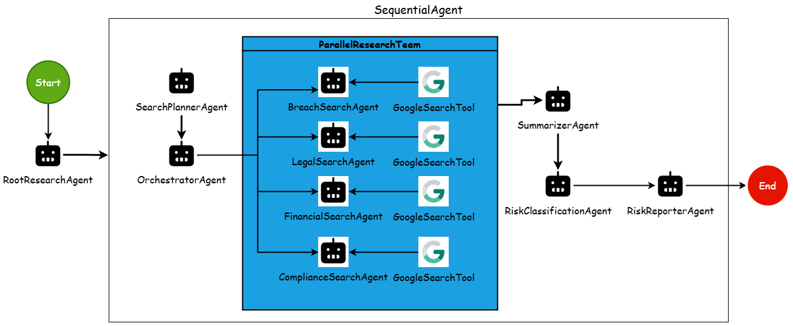

# **VendorScan – AI-Powered Vendor Risk Analyst**

### *Autonomous Third-Party Risk Assessment using Google ADK + Gemini*

---

# **1. Overview**

**VendorScan** is an autonomous multi-agent system that performs full third-party vendor risk assessments using **Google ADK** and **Gemini 2.5 Flash**.

It transforms a simple vendor onboarding form into:

* A structured investigation plan
* Parallel OSINT-driven research
* Deterministic risk scoring
* A final audit-ready report

The system behaves like a coordinated TPRM team-analyzing security, legal, financial, and compliance risk without manual effort.

[](https://www.youtube.com/watch?v=OzW1vx-dBCY)
---

# **2. Problem Statement**

Organizations depend on numerous external vendors. Every onboarding must evaluate:

* Breaches & security posture
* Legal/regulatory exposure
* Compliance claims (SOC2, ISO, etc.)
* Financial stability
* Data sensitivity & service criticality

This process is traditionally:

* **Slow** (hours–days per vendor)
* **Manual** and inconsistent
* **Fragmented across InfoSec, Legal, Procurement**
* **Dependent on optimistic vendor self-attestations**

There is no automated, scalable, evidence-backed workflow that validates vendor claims in real-time.

**VendorScan solves this by using autonomous agents that independently research, analyze, and classify risk.**

---

# **3. Setup & Installation**
## **3.1 Repository Structure**

```
vendor-risk-analysis/
│
├── assets/                     # Diagrams, images
│
├── frontend/                   # Streamlit UI
│   ├── app.py
│   ├── requirements.txt
│   ├── .env.example
│   ├── test_data.json          # Test Vendor Data

│
├── vendor_risk_analysis/       # ADK Agent System
│   ├── agent.py                # Entry point
│   ├── search_planner_agent.py
│   ├── research_agent_orchestrator.py
│   ├── research_agents.py
│   ├── summarizer_agent.py
│   ├── risk_classification_agent.py
│   ├── risk_reporter_agent.py
│   ├── sub_agents/             # Individual research agents
│   │     ├── breach_search_agent.py
│   │     ├── legal_search_agent.py
│   │     ├── compliance_search_agent.py
│   │     ├── financial_search_agent.py
│
├── requirements.txt
├── README.md
└── .env.example
```

---

## **3.2 Prerequisites**

Before running the system, install:

* Python **3.10+**
* Gemini API key from Google AI Studio

---

## **3.3 Backend Setup (Google ADK)**

### **1. Clone the Repository**

```bash
git clone https://github.com/<your-username>/vendor-risk-analysis.git
cd vendor-risk-analysis
```

### **2. Install Dependencies**

```bash
pip install -r requirements.txt
```

### **3. Configure Environment Variables**

Create `.env` (or copy `.env.example`):

```
GEMINI_API_KEY=your_api_key_here
```

### **4. Run Backend**

```bash
python vendor_risk_analysis/agent.py
```

This starts the full ADK-powered agent pipeline.

---

## **3.4 Frontend Setup (Streamlit)**

### **Install Requirements**

```bash
pip install -r frontend/requirements.txt
```

### **Run UI**

```bash
streamlit run frontend/app.py
```

### **Frontend Capabilities**

* Onboarding form
* Automatic JSON generation
* Trigger full research pipeline
* Display final consolidated risk report

**Note:** For test data you can use frontend/test_data.json file. You can copy paste the details, or else replace the vendor_payload variable in app.py with this json.
---

# **4. Solution - Autonomous Multi-Agent Risk Review**

VendorScan performs a 7-step automated evaluation:

1. **Business user inputs vendor details**
2. **SearchPlannerAgent** analyzes data & produces a complete investigation plan
3. **OrchestratorAgent** interprets the plan & activates required agents
4. **Parallel research agents** run OSINT searches using `google_search`
5. **SummarizerAgent** merges all findings
6. **RiskClassificationAgent** assigns rule-based risk levels
7. **RiskReporterAgent** generates a polished vendor report

This transforms a previously manual process into a **consistent, scalable workflow**.

---

# **5. Architecture**


```
RootResearchAgent (Sequential)
 ├── SearchPlannerAgent
 ├── OrchestratorAgent
 ├── ParallelResearchTeam
 │     ├── BreachSearchAgent
 │     ├── LegalSearchAgent
 │     ├── FinancialSearchAgent
 │     └── ComplianceSearchAgent
 ├── SummarizerAgent
 ├── RiskClassificationAgent
 └── RiskReporterAgent
```

---

# **6. Agent Responsibilities**

### **SearchPlannerAgent - Investigation Planning**

Interprets vendor details, IRQ responses, and business use-case to generate a *detailed research roadmap* with tailored search queries.

### **OrchestratorAgent - Dynamic Activation**

Reads the planner output and decides which specialized research agents to activate.

### **BreachSearchAgent - Security & Incident Analysis**

Searches for data breaches, leaked credentials, exploits, or security advisories.

### **LegalSearchAgent - Legal & Regulatory Review**

Searches for lawsuits, compliance actions, or regulatory findings.

### **FinancialSearchAgent - Stability & Viability**

Looks for layoffs, bankruptcy indicators, funding issues, and financial stress.

### **ComplianceSearchAgent - Certification Validation**

Validates vendor claims for SOC2, ISO27001, GDPR, PCI, HIPAA etc. using trust centers and public pages.

### **SummarizerAgent - Consolidated Findings**

Merges all parallel outputs into a unified narrative.

### **RiskClassificationAgent - Rule-Based Risk Scoring**

Applies deterministic scoring for:

* Security
* Legal
* Compliance
* Financial
* Overall

### **RiskReporterAgent - Final Report**

Produces structured markdown with:

* Vendor summary
* Evidence-backed findings
* Risk table
* Recommendations

---

# **7. Technical Workflow Summary**

### **Step 1 - Input Capture**

UI gathers vendor name, purpose, data processed, certifications, etc.

### **Step 2 - Search Planning**

Planner identifies:

* What needs investigation
* Why it matters
* Search queries to run

### **Step 3 - Orchestration**

Only required agents are activated-for efficiency and accuracy.

### **Step 4 - Parallel OSINT**

All research agents use **google_search** for grounded evidence.

### **Step 5 - Summary**

Noise removed, findings structured.

### **Step 6 - Classification**

Risk levels decided using rule matrices (no LLM subjectivity).

### **Step 7 - Final Report**

Readable, exportable, audit-friendly.

---

# **8. Implementation Highlights**

### ✔ Meaningful Multi-Agent Architecture

Each agent has a specific role aligned to real TPRM tasks.

### ✔ Guided Query Generation

Significantly reduces hallucination by controlling search space.

### ✔ Tool-Driven Evidence

Every claim is validated with `google_search`.

### ✔ Deterministic Risk Engine

Transparent rules ensure predictable scoring.

### ✔ UI-Backed Demonstration

The Streamlit interface simulates real business onboarding.

---

# **9. Why This System Matters**

VendorScan automates one of the slowest, most error-prone parts of procurement and security operations.

Benefits:

* Faster vendor onboarding
* Stronger risk coverage
* Reduced manual effort
* Repeatable and auditable analysis
* Objective, evidence-based scoring

It demonstrates how agentic workflows can reduce manual analyst work and scale enterprise governance.
